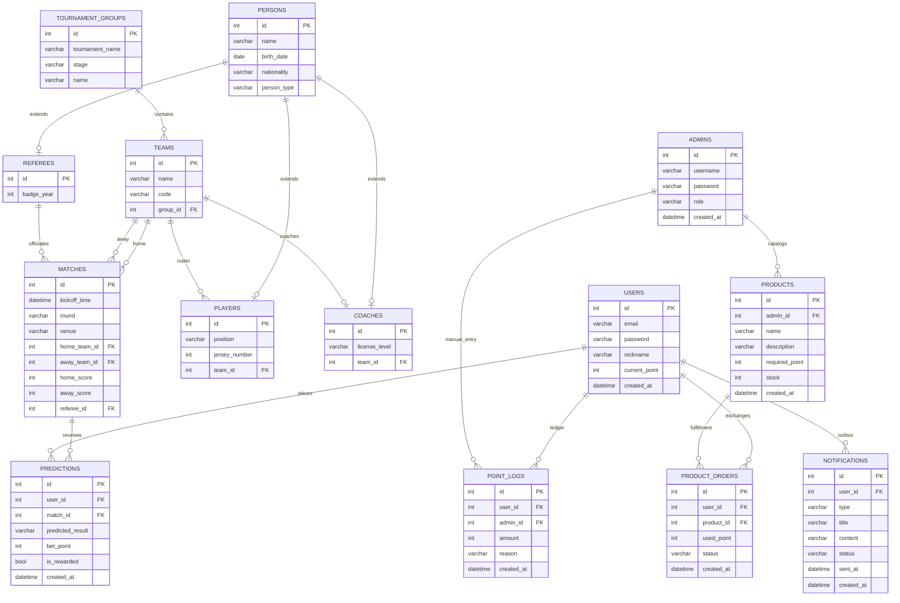

# Soccer ERD

Mermaid `erDiagram`은 속성·관계 라벨의 **따옴표·괄호·슬래시** 등에서 파싱 오류가 납니다. 필드 설명은 아래 표를 참고하세요.

다이어그램의 엔티티 이름은 Titanic ERD와 같이 짧게 썼습니다. 실제 DB 테이블은 `soccer_persons`, `soccer_teams`, `soccer_matches`, `soccer_users`, `soccer_admins`, `soccer_notifications` 등 `soccer_*` 접두 규칙과 1:1로 대응합니다. **USERS** 는 승부 예측·포인트 **플랫폼 회원**이며, 대회 인물 도메인인 **PERSONS / PLAYERS / COACHES / REFEREES** 와는 **별도 테이블·FK 연결이 없습니다** (동일 인물을 연결하지 않는 한 관계가 꼬이지 않음).



## 관계

| 관계 | 설명 |
|------|------|
| TEAMS → MATCHES | 1:N, 홈 경기 (`MATCHES.home_team_id` → `TEAMS.id`, `CASCADE`) |
| TEAMS → MATCHES | 1:N, 원정 경기 (`MATCHES.away_team_id` → `TEAMS.id`, `CASCADE`) |
| REFEREES → MATCHES | 1:N, 심판 배정 (`MATCHES.referee_id` → `REFEREES.id`, `SET NULL`) |
| PERSONS → PLAYERS | 1:0..1, joined-table 상속. `PLAYERS.id` 는 `int` PK이며 `PERSONS.id` 를 참조하는 FK (`CASCADE`) |
| PERSONS → COACHES | 1:0..1, joined-table 상속. `COACHES.id` 는 `int` PK이며 `PERSONS.id` 를 참조하는 FK (`CASCADE`) |
| PERSONS → REFEREES | 1:0..1, joined-table 상속 (`REFEREES.id` → `PERSONS.id`, `CASCADE`) |
| TOURNAMENT_GROUPS → TEAMS | 1:N, 대회 조 소속 (`TEAMS.group_id` → `TOURNAMENT_GROUPS.id`, `SET NULL`) |
| TEAMS → PLAYERS | 1:N, 스쿼드. 클럽·국가대표팀 등 소속은 `team_id` 로만 연결 (`PLAYERS.team_id` → `TEAMS.id`, `SET NULL`) |
| TEAMS → COACHES | 1:0..1, 감독 배정 (`COACHES.team_id` UNIQUE, `SET NULL`) |
| USERS → PREDICTIONS | 1:N, 승무패 배팅 (`PREDICTIONS.user_id` → `USERS.id`, `CASCADE`). 동일 경기 1회만: `UNIQUE (user_id, match_id)` |
| MATCHES → PREDICTIONS | 1:N, 배팅 대상 경기 (`PREDICTIONS.match_id` → `MATCHES.id` / `soccer_matches.id`, `CASCADE`) |
| USERS → POINT_LOGS | 1:N, 포인트 장부 (`POINT_LOGS.user_id` → `USERS.id`, `CASCADE`) |
| USERS → PRODUCT_ORDERS | 1:N, 경품 신청 (`PRODUCT_ORDERS.user_id` → `USERS.id`, `ON DELETE RESTRICT`) |
| PRODUCTS → PRODUCT_ORDERS | 1:N, 신청 대상 상품 (`PRODUCT_ORDERS.product_id` → `PRODUCTS.id`, `ON DELETE RESTRICT`) |
| ADMINS → PRODUCTS | 1:N, 등록 관리자 (`PRODUCTS.admin_id` → `ADMINS.id` / `soccer_admins.id`, `ON DELETE SET NULL` — 관리자 삭제 시 추적만 해제) |
| ADMINS → POINT_LOGS | 0..1 per row, 수동 지급·차감 시에만 채움 (`POINT_LOGS.admin_id` → `ADMINS.id`, nullable, `ON DELETE SET NULL`) |
| USERS → NOTIFICATIONS | 1:N, SMS·EMAIL 큐/이력 (`NOTIFICATIONS.user_id` → `USERS.id`, `CASCADE`) |

**도메인 분리:** `PERSONS` 계열과 `USERS`(플랫폼 회원) 사이, **`ADMINS`(백오피스 계정)과 `USERS` 사이에는 FK 가 없습니다.** 관리자와 회원을 동일 테이블에 합치지 않는 한 권한·감사 추적이 꼬이지 않습니다.

## 필드 설명

| 엔티티               | 필드              | 설명                                          |
| ----------------- | --------------- | ------------------------------------------- |
| PERSONS           | id              | 기본 키, `int`, 자동 증가                          |
| PERSONS           | name            | 이름                                          |
| PERSONS           | birth_date      | 생년월일, 선택                                    |
| PERSONS           | nationality     | 국적, 선택                                      |
| PERSONS           | person_type     | ORM 다형 구분 player / coach / referee / person |
| PLAYERS           | id              | `int`. 부모 `PERSONS.id` 와 동일 값인 PK이자 FK      |
| PLAYERS           | position        | 포지션                                         |
| PLAYERS           | jersey_number   | 등번호                                         |
| PLAYERS           | team_id         | 소속 팀 FK. 구단·국가대표팀 정보는 `TEAMS` 로만 표현         |
| COACHES           | id              | `int`. 부모 `PERSONS.id` 와 동일 값인 PK이자 FK      |
| COACHES           | license_level   | 자격 등급                                       |
| COACHES           | team_id         | 담당 팀 FK, 팀당 최대 1명을 위해 UNIQUE                |
| REFEREES          | id              | `int`. 부모 `PERSONS.id` 와 동일 값인 PK이자 FK      |
| REFEREES          | badge_year      | 배지 연도                                       |
| TOURNAMENT_GROUPS | id              | 대회 조 PK                                     |
| TOURNAMENT_GROUPS | tournament_name | 대회명. 예: FIFA World Cup 2026                 |
| TOURNAMENT_GROUPS | stage           | 단계. 예: 본선 조별리그                              |
| TOURNAMENT_GROUPS | name            | 조 라벨. 예: A, B. 동일 대회·단계 내 조합은 DB에서 유일       |
| TEAMS             | id              | 팀 PK                                        |
| TEAMS             | name            | 팀명                                          |
| TEAMS             | code            | 3글자 코드, DB에서 UNIQUE 인덱스                     |
| TEAMS             | group_id        | 소속 대회 조 FK, 선택                              |
| MATCHES           | kickoff_time    | 킥오프 시각                                      |
| MATCHES           | round           | 라운드명                                        |
| MATCHES           | venue           | 경기장                                         |
| MATCHES           | home_team_id    | 홈 팀 FK                                      |
| MATCHES           | away_team_id    | 원정 팀 FK                                     |
| MATCHES           | home_score      | 홈 득점, 선택                                    |
| MATCHES           | away_score      | 원정 득점, 선택                                   |
| MATCHES           | referee_id      | 심판 FK, 선택                                   |
| USERS             | id              | 플랫폼 회원 PK. `PERSONS.id` 와 무관                         |
| USERS             | email           | 로그인, UNIQUE                                 |
| USERS             | password        | 비밀번호(해시 저장 권장)                              |
| USERS             | nickname        | 표시 닉네임, UNIQUE                              |
| USERS             | current_point   | 잔여 포인트, 기본 0                               |
| USERS             | created_at      | 생성 시각                                        |
| PREDICTIONS       | id              | 예측 행 PK                                     |
| PREDICTIONS       | user_id         | `USERS.id` FK                                 |
| PREDICTIONS       | match_id        | `MATCHES.id` / `soccer_matches.id` FK         |
| PREDICTIONS       | predicted_result | `HOME_WIN` / `DRAW` / `AWAY_WIN` (DB CHECK)   |
| PREDICTIONS       | bet_point       | 배팅 포인트, 0 초과 (CHECK)                        |
| PREDICTIONS       | is_rewarded     | 정산 완료 여부, 기본 false                        |
| PREDICTIONS       | created_at      | 생성 시각                                        |
| POINT_LOGS        | id              | 이력 PK                                       |
| POINT_LOGS        | user_id         | `USERS.id` FK                                 |
| POINT_LOGS        | admin_id        | 수동 조정 시 `ADMINS.id` FK, 시스템 자동이면 NULL (`ON DELETE SET NULL`) |
| POINT_LOGS        | amount          | 지급 양수·차감 음수                                 |
| POINT_LOGS        | reason          | 예: `PREDICTION_BET`, `ADMIN_ADJUST`, `GIFT_EXCHANGE` |
| POINT_LOGS        | created_at      | 변동 시각                                        |
| PRODUCTS          | id              | 경품 마스터 PK                                   |
| PRODUCTS          | admin_id        | 등록 관리자 `ADMINS.id` FK, 선택 (`ON DELETE SET NULL`) |
| PRODUCTS          | name            | 경품명                                         |
| PRODUCTS          | description     | 상세 설명                                       |
| PRODUCTS          | required_point  | 교환 필요 포인트, 0 초과 (CHECK)                    |
| PRODUCTS          | stock           | 재고, 기본 0                                    |
| PRODUCTS          | created_at      | 등록 시각                                        |
| PRODUCT_ORDERS    | id              | 교환 신청 PK                                    |
| PRODUCT_ORDERS    | user_id         | `USERS.id` FK, 삭제 시 RESTRICT                  |
| PRODUCT_ORDERS    | product_id      | `PRODUCTS.id` FK, 삭제 시 RESTRICT              |
| PRODUCT_ORDERS    | used_point      | 교환 시 소모 포인트                                 |
| PRODUCT_ORDERS    | status          | `PENDING` 기본, `SHIPPED` / `COMPLETED` / `CANCELED` |
| PRODUCT_ORDERS    | created_at      | 신청 시각                                        |
| ADMINS            | id              | 관리자 PK                                      |
| ADMINS            | username        | 로그인 ID, UNIQUE                              |
| ADMINS            | password        | 비밀번호(해시 저장 권장)                            |
| ADMINS            | role            | 기본 `MANAGER`, 확장 시 CHECK 로 강화 가능            |
| ADMINS            | created_at      | 생성 시각                                        |
| NOTIFICATIONS     | id              | 알림 행 PK                                     |
| NOTIFICATIONS     | user_id         | 수신 회원 `USERS.id` FK                         |
| NOTIFICATIONS     | type            | `SMS` / `EMAIL` (CHECK), 추후 채널 추가 시 CHECK 갱신   |
| NOTIFICATIONS     | title           | 제목, 선택                                       |
| NOTIFICATIONS     | content         | 본문 `TEXT`                                    |
| NOTIFICATIONS     | status          | `PENDING` 기본, `SUCCESS` / `FAILED` (CHECK)    |
| NOTIFICATIONS     | sent_at         | 발송 완료 시각, 미발송이면 NULL                      |
| NOTIFICATIONS     | created_at      | 큐 적재 시각                                     |

---

## 승무패 예측 포인트 배팅·경품 교환 (신규 DDL)

아래는 **기존 `soccer_matches`(MATCHES)** 의 `id` 와 FK 로 연결되는 배팅·포인트·경품 스키마입니다. 물리 테이블명은 저장소의 `soccer_*` 접두 규칙에 맞췄고, 명세의 논리 이름과 대응 관계는 표를 참고하세요.

| 논리 이름 (명세)     | 물리 테이블명                 |
| -------------- | ----------------------- |
| USERS          | `soccer_users`          |
| ADMINS         | `soccer_admins`         |
| PREDICTIONS    | `soccer_predictions`    |
| POINT_LOGS     | `soccer_point_logs`     |
| PRODUCTS       | `soccer_products`       |
| PRODUCT_ORDERS | `soccer_product_orders` |
| NOTIFICATIONS  | `soccer_notifications`  |

### 신규 관계 요약

위 **관계** 절의 `USERS`·`ADMINS`·`PREDICTIONS`·`POINT_LOGS`·`PRODUCTS`·`PRODUCT_ORDERS`·`NOTIFICATIONS` 행과 동일합니다. FK·`ON DELETE`·`UNIQUE` 는 아래 DDL 과 일치합니다.

### PostgreSQL DDL (전체 신규 스키마)

`ADMINS` 는 `PRODUCTS`·`POINT_LOGS` 보다 **먼저** 생성해야 FK 를 걸 수 있습니다. `NOTIFICATIONS` 는 `USERS` 에만 의존하므로 `soccer_users` 생성 직후 또는 주문 테이블 이후 어느 쪽이든 무방합니다.

```sql
-- =============================================================================
-- 승무패 예측 포인트 배팅·경품·관리자·알림 (soccer_*)
-- 전제: 기존 soccer_matches(id) 가 이미 존재함.
-- =============================================================================

CREATE TABLE soccer_users (
    id            INTEGER GENERATED BY DEFAULT AS IDENTITY PRIMARY KEY,
    email         VARCHAR(320)  NOT NULL,
    password      VARCHAR(255)  NOT NULL,
    nickname      VARCHAR(64)   NOT NULL,
    current_point INTEGER       NOT NULL DEFAULT 0,
    created_at    TIMESTAMPTZ   NOT NULL DEFAULT now(),
    CONSTRAINT uq_soccer_users_email UNIQUE (email),
    CONSTRAINT uq_soccer_users_nickname UNIQUE (nickname)
);

CREATE TABLE soccer_admins (
    id         INTEGER GENERATED BY DEFAULT AS IDENTITY PRIMARY KEY,
    username   VARCHAR(64)  NOT NULL,
    password   VARCHAR(255) NOT NULL,
    role       VARCHAR(32)  NOT NULL DEFAULT 'MANAGER',
    created_at TIMESTAMPTZ  NOT NULL DEFAULT now(),
    CONSTRAINT uq_soccer_admins_username UNIQUE (username)
);

CREATE TABLE soccer_predictions (
    id                INTEGER GENERATED BY DEFAULT AS IDENTITY PRIMARY KEY,
    user_id           INTEGER NOT NULL,
    match_id          INTEGER NOT NULL,
    predicted_result  VARCHAR(16) NOT NULL,
    bet_point         INTEGER NOT NULL,
    is_rewarded       BOOLEAN NOT NULL DEFAULT false,
    created_at        TIMESTAMPTZ NOT NULL DEFAULT now(),
    CONSTRAINT fk_soccer_predictions_user
        FOREIGN KEY (user_id) REFERENCES soccer_users (id) ON DELETE CASCADE,
    CONSTRAINT fk_soccer_predictions_match
        FOREIGN KEY (match_id) REFERENCES soccer_matches (id) ON DELETE CASCADE,
    CONSTRAINT uq_soccer_predictions_user_match UNIQUE (user_id, match_id),
    CONSTRAINT ck_soccer_predictions_result
        CHECK (predicted_result IN ('HOME_WIN', 'DRAW', 'AWAY_WIN')),
    CONSTRAINT ck_soccer_predictions_bet_point_positive
        CHECK (bet_point > 0)
);

CREATE INDEX ix_soccer_predictions_match_id ON soccer_predictions (match_id);
CREATE INDEX ix_soccer_predictions_user_id ON soccer_predictions (user_id);

CREATE TABLE soccer_point_logs (
    id         INTEGER GENERATED BY DEFAULT AS IDENTITY PRIMARY KEY,
    user_id    INTEGER NOT NULL,
    admin_id   INTEGER,
    amount     INTEGER NOT NULL,
    reason     VARCHAR(64) NOT NULL,
    created_at TIMESTAMPTZ NOT NULL DEFAULT now(),
    CONSTRAINT fk_soccer_point_logs_user
        FOREIGN KEY (user_id) REFERENCES soccer_users (id) ON DELETE CASCADE,
    CONSTRAINT fk_soccer_point_logs_admin
        FOREIGN KEY (admin_id) REFERENCES soccer_admins (id) ON DELETE SET NULL
);

CREATE INDEX ix_soccer_point_logs_user_id ON soccer_point_logs (user_id);
CREATE INDEX ix_soccer_point_logs_admin_id ON soccer_point_logs (admin_id);
CREATE INDEX ix_soccer_point_logs_created_at ON soccer_point_logs (created_at);

CREATE TABLE soccer_products (
    id              INTEGER GENERATED BY DEFAULT AS IDENTITY PRIMARY KEY,
    admin_id        INTEGER,
    name            VARCHAR(200) NOT NULL,
    description     TEXT,
    required_point  INTEGER NOT NULL,
    stock           INTEGER NOT NULL DEFAULT 0,
    created_at      TIMESTAMPTZ NOT NULL DEFAULT now(),
    CONSTRAINT fk_soccer_products_admin
        FOREIGN KEY (admin_id) REFERENCES soccer_admins (id) ON DELETE SET NULL,
    CONSTRAINT ck_soccer_products_required_point_positive
        CHECK (required_point > 0)
);

CREATE INDEX ix_soccer_products_admin_id ON soccer_products (admin_id);

CREATE TABLE soccer_product_orders (
    id         INTEGER GENERATED BY DEFAULT AS IDENTITY PRIMARY KEY,
    user_id    INTEGER NOT NULL,
    product_id INTEGER NOT NULL,
    used_point INTEGER NOT NULL,
    status     VARCHAR(32) NOT NULL DEFAULT 'PENDING',
    created_at TIMESTAMPTZ NOT NULL DEFAULT now(),
    CONSTRAINT fk_soccer_product_orders_user
        FOREIGN KEY (user_id) REFERENCES soccer_users (id) ON DELETE RESTRICT,
    CONSTRAINT fk_soccer_product_orders_product
        FOREIGN KEY (product_id) REFERENCES soccer_products (id) ON DELETE RESTRICT,
    CONSTRAINT ck_soccer_product_orders_status
        CHECK (status IN ('PENDING', 'SHIPPED', 'COMPLETED', 'CANCELED'))
);

CREATE INDEX ix_soccer_product_orders_user_id ON soccer_product_orders (user_id);
CREATE INDEX ix_soccer_product_orders_product_id ON soccer_product_orders (product_id);

CREATE TABLE soccer_notifications (
    id         INTEGER GENERATED BY DEFAULT AS IDENTITY PRIMARY KEY,
    user_id    INTEGER NOT NULL,
    type       VARCHAR(16)  NOT NULL,
    title      VARCHAR(255),
    content    TEXT         NOT NULL,
    status     VARCHAR(16)  NOT NULL DEFAULT 'PENDING',
    sent_at    TIMESTAMPTZ,
    created_at TIMESTAMPTZ  NOT NULL DEFAULT now(),
    CONSTRAINT fk_soccer_notifications_user
        FOREIGN KEY (user_id) REFERENCES soccer_users (id) ON DELETE CASCADE,
    CONSTRAINT ck_soccer_notifications_type
        CHECK (type IN ('SMS', 'EMAIL')),
    CONSTRAINT ck_soccer_notifications_status
        CHECK (status IN ('PENDING', 'SUCCESS', 'FAILED'))
);

CREATE INDEX ix_soccer_notifications_user_id ON soccer_notifications (user_id);
CREATE INDEX ix_soccer_notifications_status_created
    ON soccer_notifications (status, created_at);
```

### 기존 DB에 이미 배팅 스키마만 있을 때 (ALTER)

아래는 **이전 버전 문서의 `soccer_products` / `soccer_point_logs`에 `admin_id`가 없는 경우**에 적용합니다. `soccer_admins`·`soccer_notifications` 는 신규 `CREATE` 입니다. 컬럼·제약이 이미 있으면 해당 문은 건너뜁니다.

```sql
CREATE TABLE soccer_admins (
    id         INTEGER GENERATED BY DEFAULT AS IDENTITY PRIMARY KEY,
    username   VARCHAR(64)  NOT NULL,
    password   VARCHAR(255) NOT NULL,
    role       VARCHAR(32)  NOT NULL DEFAULT 'MANAGER',
    created_at TIMESTAMPTZ  NOT NULL DEFAULT now(),
    CONSTRAINT uq_soccer_admins_username UNIQUE (username)
);

ALTER TABLE soccer_products
    ADD COLUMN admin_id INTEGER;

ALTER TABLE soccer_products
    ADD CONSTRAINT fk_soccer_products_admin
    FOREIGN KEY (admin_id) REFERENCES soccer_admins (id) ON DELETE SET NULL;

CREATE INDEX IF NOT EXISTS ix_soccer_products_admin_id ON soccer_products (admin_id);

ALTER TABLE soccer_point_logs
    ADD COLUMN admin_id INTEGER;

ALTER TABLE soccer_point_logs
    ADD CONSTRAINT fk_soccer_point_logs_admin
    FOREIGN KEY (admin_id) REFERENCES soccer_admins (id) ON DELETE SET NULL;

CREATE INDEX IF NOT EXISTS ix_soccer_point_logs_admin_id ON soccer_point_logs (admin_id);

CREATE TABLE soccer_notifications (
    id         INTEGER GENERATED BY DEFAULT AS IDENTITY PRIMARY KEY,
    user_id    INTEGER NOT NULL,
    type       VARCHAR(16)  NOT NULL,
    title      VARCHAR(255),
    content    TEXT         NOT NULL,
    status     VARCHAR(16)  NOT NULL DEFAULT 'PENDING',
    sent_at    TIMESTAMPTZ,
    created_at TIMESTAMPTZ  NOT NULL DEFAULT now(),
    CONSTRAINT fk_soccer_notifications_user
        FOREIGN KEY (user_id) REFERENCES soccer_users (id) ON DELETE CASCADE,
    CONSTRAINT ck_soccer_notifications_type
        CHECK (type IN ('SMS', 'EMAIL')),
    CONSTRAINT ck_soccer_notifications_status
        CHECK (status IN ('PENDING', 'SUCCESS', 'FAILED'))
);

CREATE INDEX IF NOT EXISTS ix_soccer_notifications_user_id ON soccer_notifications (user_id);
CREATE INDEX IF NOT EXISTS ix_soccer_notifications_status_created
    ON soccer_notifications (status, created_at);
```

### 명세 대비 보조 설명

- **`PRODUCTS.admin_id`**: 명세의 `SET NULL` vs `RESTRICT` 중 **등록 추적을 끊어도 상품 행은 유지**하려면 `ON DELETE SET NULL` 이 안전합니다. 관리자 삭제를 원천 차단하려면 `RESTRICT` 로 바꾸세요.
- **`POINT_LOGS.admin_id`**: 시스템 자동 적립·차감은 `NULL`, 관리자 수동만 값 설정.
- **`NOTIFICATIONS.type`**: `PUSH` 등을 추가할 때는 `CHECK` 절에 값을 확장하면 됩니다.
- **PostgreSQL**: `CREATE INDEX IF NOT EXISTS` 는 PG 9.5+ 입니다. 더 낮은 버전이면 인덱스 생성 전 존재 여부를 수동 확인하세요.
- **PK**: 모두 `INTEGER … AS IDENTITY` 로 통일 (PostgreSQL에서 `int` 자동 증가에 해당).
- **`predicted_result`**: 명세의 `enum` 대신 `VARCHAR` + `CHECK` 로 세 값만 허용.
- **`PRODUCT_ORDERS.status`**: 기본값 `PENDING`, 허용 값은 `CHECK` 로 고정.
- **`current_point` / `stock`**: 명세에 별도 `CHECK` 는 없음. 음수 방지가 필요하면 애플리케이션 또는 추가 `CHECK` 로 보강.
- **`password`**: 해시 저장을 가정해 `VARCHAR(255)` 권장 길이.
- **`created_at`**: PostgreSQL에서는 `TIMESTAMPTZ` + `DEFAULT now()` 로 생성·변경 시각의 기준을 명확히 했습니다. (명세의 `datetime` 에 대응.)
- **MySQL/MariaDB** 등으로 옮길 때는 `IDENTITY`/`TIMESTAMPTZ`/`BOOLEAN` 문법만 환경에 맞게 치환하면 됩니다.
